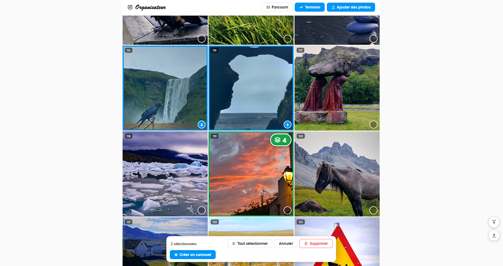

<div align="center">



# 📸 InstaFidz

**A simple, private feed planner: arrange your photos exactly as they will appear on your Instagram profile, before you post them.**  
One HTML file. Vanilla JavaScript. No install, no account, no upload.

[](index.html)
[](https://developer.mozilla.org/en-US/docs/Web/JavaScript)
[](https://developer.mozilla.org/en-US/docs/Web/API/IndexedDB_API)
[](#privacy)
[](LICENSE)

</div>

---

## What is this?

InstaFidz is **just an organizer**. It does not connect to Instagram, it does not post anything, and it does not need an account. Its only job is to help you **plan the order of your photos** so your profile grid looks the way you want once everything is published.

You drop in your edited photos (or a whole folder of them), then:

- drag them around the 3-column grid until the feed looks right,
- group several photos into **carousels** and choose the order inside each one,
- preview any post full screen, at full resolution,
- close the page and come back later: **your work is saved automatically** in your browser.

Then you open Instagram and publish in the order you planned.

> The interface is currently in French. This README and the code structure are documented in English.

> InstaFidz is an independent project. It is not affiliated with, endorsed by, or connected to Instagram or Meta.

---

## Quick Start

### Option A: use it online (recommended)

Open the GitHub Pages URL of the repository:

```
https://thesirix.github.io/instafidz/
```

Everything works out of the box, including dragging a whole folder (with sub-folders) onto the page.

### Option B: run it locally on Windows

```bash
git clone https://github.com/Thesirix/instafidz.git
cd instafidz
```

Then double-click **`Lancer-organisateur.bat`**. It opens InstaFidz in a dedicated Chrome (or Edge) window where folder drag & drop is enabled, even if Chrome is already open.

### Option C: just open the file

Double-click `index.html`. Photos can be dragged in normally. For folders, use the **Parcourir** (Browse) button: Chromium blocks folder drops on pages opened straight from disk ([why](#the-file-limitation)).

### Your first feed in 5 steps

| Step | Action                                                                                   | UI element                            |
| ---- | ---------------------------------------------------------------------------------------- | ------------------------------------- |
| 1    | Import photos: drop files/folders, or use the buttons                                    | **Ajouter des photos** / **Parcourir** |
| 2    | Reorder: drag a tile onto another tile                                                   | the grid                              |
| 3    | Move far in one go: while dragging, hover the blue bar at the top or bottom of the screen | drag zones                            |
| 4    | Build carousels: select photos **in the order you want them to appear**, then group      | **Sélectionner** → **Créer un carousel** |
| 5    | Check a post full screen, reorder its carousel slides, ungroup or delete it              | click a tile                          |

### Publishing order

Position **1** is the top-left tile, which on Instagram is your **most recent** post. To reproduce your plan on your real profile, **publish from the highest number down to 1**.

---

## How It Works

The whole application is a single static file. There is no backend, no framework, and no build step:

```
index.html                ←  HTML + CSS + vanilla JS, the entire app (~42 KB)
Lancer-organisateur.bat   ←  optional Windows launcher (dedicated Chromium window)
```

The only external resource is the [Tabler Icons](https://tabler.io/icons) webfont (v3.31.0, loaded from jsDelivr). If you are offline, icons are missing but the app still works.

### 1. Data Model

The feed is an ordered array of posts. A post with more than one photo is a carousel:

```js
posts = [
  { id: 'post-lx2k9f-a8b3c1', photoIds: ['p12'] },               // single photo
  { id: 'post-lx2kaa-9d0e2f', photoIds: ['p3', 'p7', 'p8', 'p4'] } // carousel, slide order
];

photoStore = {
  p12: { id: 'p12', name: 'DSC08577.png', sig: 'DSC08577.png|4812331|1752157519000',
         thumbUrl: 'blob:…', file: File /* only for photos imported this session */ }
};

selectedIds = new Set(); // a Set keeps insertion order = the order you clicked
```

Array index = feed position. Moving a photo is a plain `splice` out and `splice` in.

### 2. Persistence (IndexedDB)

Everything is stored in the browser, in a database named `feedOrganizerDB` (version 2):

| Object store | Key   | Content                                                    | Why                                     |
| ------------ | ----- | ---------------------------------------------------------- | --------------------------------------- |
| `photos`     | `id`  | `{ id, blob, name, sig }`, the **original file**, untouched | full-resolution preview                 |
| `thumbs`     | `id`  | `{ id, blob, name, sig }`, a JPEG thumbnail                | fast grid rendering                     |
| `meta`       | `key` | `{ key: 'posts', value: [{ id, photoIds }] }`              | feed order and carousel composition     |

At startup, the app reads **only the keys** of `photos`, plus every thumbnail and the `meta` record. Originals are never loaded into memory until you open one full screen. Posts that reference a missing photo are dropped, and duplicated post IDs are regenerated.

It also calls `navigator.storage.persist()` so the browser does not evict your library when disk space runs low.

#### Save status and safety

Every write goes through a single wrapper that counts pending transactions:

```js
pendingWrites++;
const tx = db.transaction(storeName, 'readwrite');
op(tx.objectStore(storeName));
tx.oncomplete = () => finish();
tx.onerror = tx.onabort = () => finish(tx.error || new Error('Transaction annulée'));
```

| State    | Shown when                                                         | Label                                   |
| -------- | ------------------------------------------------------------------ | --------------------------------------- |
| `saved`  | no pending write                                                   | *Travail sauvegardé*                    |
| `saving` | a write has been pending for more than 300 ms (avoids flicker)     | *Sauvegarde en cours… ne fermez pas la page* |
| `error`  | a transaction failed or aborted (typically: disk quota exceeded)   | *Erreur de sauvegarde*                  |
| `off`    | IndexedDB is unavailable (private browsing) or the saved data could not be read | *Sauvegarde impossible ici*   |

- If you try to close the tab while `pendingWrites > 0`, a `beforeunload` confirmation appears.
- If the existing save cannot be read, the app switches to `off` instead of writing. **It never overwrites a library it failed to load.**

### 3. Thumbnail Pipeline

4K originals are never displayed in the grid. Each imported photo goes through a small work queue:

```
original File ──▶ createImageBitmap ──▶ canvas (short side = 640 px) ──▶ JPEG q=0.82 ──▶ IndexedDB `thumbs` ──▶ blob: URL ──▶ grid
```

```js
const THUMB_SIZE = 640;       // short side of the thumbnail, in px
const THUMB_CONCURRENCY = 3;  // thumbnails generated in parallel

const scale = Math.min(1, THUMB_SIZE / Math.min(bmp.width, bmp.height)); // never upscales
canvas.toBlob(res, 'image/jpeg', 0.82);
```

- Thumbnails are generated **once**, then reused on every visit.
- A progress indicator (*Préparation des vignettes x/y*) is shown while the queue is running.
- Libraries created with the previous version (no `thumbs` store) get their thumbnails built at startup, in feed order.

### 4. Full-Screen Preview

Opening a post shows its thumbnail **instantly** (slightly blurred), then swaps in the original once it is decoded:

```js
lbImg.src = photo.thumbUrl;          // immediate, blurred preview
const loader = new Image();
loader.src = URL.createObjectURL(blob);
await loader.decode();               // decode off-screen, no jank
if(token !== fullToken) return;      // user already moved to another photo
lbImg.src = loader.src;
```

A token counter discards stale loads when you navigate quickly. The previous object URL is revoked each time, so memory stays flat.

### 5. Rendering

The grid uses keyed DOM reconciliation instead of rebuilding HTML:

- `tiles: Map<post.id, HTMLElement>` keeps each tile alive between renders,
- a render only **moves** nodes whose index changed and updates badges/classes,
- renders triggered by background work (thumbnails) are coalesced with `requestAnimationFrame`,
- images use `loading="lazy"` and `decoding="async"`.

Reordering a 200-photo feed does not reload a single image.

---

## Import System

### Sources

| Source                   | API                                               | Sub-folders |
| ------------------------ | ------------------------------------------------- | ----------- |
| **Ajouter des photos**   | `<input type="file" accept="image/*" multiple>`    | n/a         |
| **Parcourir** (Browse)   | `<input type="file" webkitdirectory>`              | ✅          |
| Drop files               | `DataTransferItem.getAsFile()`                     | n/a         |
| Drop folders             | `DataTransferItem.webkitGetAsEntry()` + recursion | ✅          |

### Recursive folder reading

`readEntries()` returns directory content **in batches** (Chromium caps each batch at 100 entries), so the reader loops until it gets an empty batch:

```js
function readAllEntries(dirEntry){
  const reader = dirEntry.createReader();
  const all = [];
  return new Promise((resolve, reject) => {
    const next = () => reader.readEntries(batch => {
      if(!batch.length) return resolve(all);
      all.push(...batch);
      next();
    }, reject);
    next();
  });
}
```

All drop items are captured **synchronously** inside the `drop` event, because the `DataTransfer` becomes unreadable once the handler returns.

### Filtering, sorting, de-duplication

```js
const IMAGE_EXT = /\.(jpe?g|png|webp|gif|avif|bmp)$/i;
function isImageFile(f){ return f.type.startsWith('image/') || IMAGE_EXT.test(f.name); }

// same name + same size + same last-modified date = same photo
function fileSignature(f){ return `${f.name}|${f.size}|${f.lastModified}`; }
```

- Non-image files (`.txt`, `.xmp`, `Thumbs.db`…) are ignored.
- Files are sorted by full path with a **natural sort** (`localeCompare(…, { numeric: true })`), so `img2` comes before `img10` and sub-folders stay grouped.
- A photo whose signature already exists, in the library **or** earlier in the same import, is skipped. The notification says how many: *142 photo(s) ajoutée(s) · 64 doublon(s) ignoré(s)*. Re-importing a folder after adding new pictures to it only adds the new ones.
- New photos are inserted **at the top** of the feed, like new Instagram posts.

### The `file://` limitation

When `index.html` is opened directly from disk, its origin is `file://`. Chromium refuses to read dropped **directories** from such pages: `readEntries()` fails with

```
EncodingError: A URI supplied to the API was malformed…
```

Dropped **files** are not affected (they are read with `getAsFile()`). InstaFidz detects the failure and tells you what to do instead. Three ways to get folder drops:

| Method                        | How it works                                                              |
| ----------------------------- | ------------------------------------------------------------------------- |
| GitHub Pages (or any web server) | the page has a real `https://` origin, nothing is blocked               |
| `Lancer-organisateur.bat`     | launches Chromium with `--allow-file-access-from-files`                   |
| **Parcourir** button          | `webkitdirectory` input, works everywhere                                 |

---

## Organizing

### Drag & drop reordering

Native HTML5 drag & drop. Dropping a tile on another tile moves it to that position.

**Jump zones.** Auto-scrolling a long feed while holding a photo is slow. While a drag is in progress, two full-width drop zones appear at the top and bottom of the viewport:

| Interaction                  | Result                                              |
| ---------------------------- | --------------------------------------------------- |
| hover the **bottom** zone    | page jumps instantly to the end of the feed         |
| hover the **top** zone       | page jumps instantly to the start of the feed       |
| drop on a zone               | photo is placed at the very last / very first position |

The zones are shown one frame after `dragstart`, because mutating the DOM inside `dragstart` can cancel the drag in Chromium:

```js
requestAnimationFrame(() => { if(draggedPostId !== null) setDragZones(true); });
```

Two floating buttons (bottom right) also scroll to the top or bottom of the page outside of a drag.

### Selection and carousels

- **Sélectionner** enters selection mode. Each click adds a numbered badge (**1, 2, 3…**): this is the slide order of the future carousel.
- **Tout sélectionner** selects the whole feed (it becomes **Tout désélectionner**), and **Ctrl+A** / **⌘+A** does the same from anywhere.
- **Créer un carousel** merges the selected posts, in click order, into one post placed at the position of the **first** selected post. Selecting an existing carousel inlines its slides.
- **Supprimer** deletes the selected posts (with confirmation) and their stored files.

### Full-screen view

| Action                    | How                                                     |
| ------------------------- | ------------------------------------------------------- |
| Next / previous slide     | arrows on screen, or `←` `→`                            |
| Reorder carousel slides   | drag the thumbnails in the bottom strip                 |
| Ungroup a carousel        | **Dissocier**: every slide becomes a single post, in place |
| Delete the post           | **Supprimer**                                           |
| Close                     | ✕ or `Esc`                                              |

### Keyboard shortcuts

| Shortcut         | Context          | Action                               |
| ---------------- | ---------------- | ------------------------------------ |
| `Ctrl+A` / `⌘+A` | grid             | enter selection mode and select all  |
| `←` / `→`        | full-screen view | previous / next slide                |
| `Esc`            | full-screen view | close                                |

---

## Visual Design

| Element             | Style                                                                     |
| ------------------- | ------------------------------------------------------------------------- |
| Grid                | 3 columns, 3 px gap, square tiles (`aspect-ratio: 1/1`, `object-fit: cover`) |
| Feed position badge | top-left, dark translucent pill                                           |
| Carousel            | 4 px green border (`#16A34A`) + large badge with the slide count          |
| Selected            | 4 px blue border (`#0095F6`), blue tint, numbered check in click order    |
| Drop target         | 4 px dashed blue border                                                   |
| Palette             | Instagram-like light theme, automatic dark theme via `prefers-color-scheme` |
| Layout              | max width 975 px (Instagram profile width), responsive below 600 px       |

---

## Privacy

- **Your photos never leave your computer.** There is no server: files are read by the browser and stored in its local IndexedDB.
- **Each person has their own library**, empty at first. Sharing the link or the repository shares the tool, never your photos.
- Libraries are separated **per origin**: the GitHub Pages site, the local `index.html`, and the launcher window each keep their own independent save.
- The launcher stores its browser profile in `%LOCALAPPDATA%\OrganisateurFeed\profil-navigateur`, **outside** the project folder.
- `.gitignore` blocks image files (`*.jpg`, `*.png`, `*.heic`, RAW formats…) so personal photos cannot be committed by accident. Only `instafidz.png`, the README screenshot, is allowed.
- Clearing your browser data or using private browsing erases (or prevents) the save.

---

## The Windows Launcher

`Lancer-organisateur.bat` does four things:

1. looks for a Chromium browser, in this order: Chrome (`Program Files`, `Program Files (x86)`, `%LocalAppData%`), then Edge,
2. checks that `index.html` sits next to it,
3. starts the browser with:

```bat
start "" "%BROWSER%" --user-data-dir="%PROFILE%" --allow-file-access-from-files ^
      --no-first-run --no-default-browser-check --app="%PAGE%"
```

4. prints a clear message and pauses if no browser or no `index.html` is found.

| Flag                             | Purpose                                                                    |
| -------------------------------- | -------------------------------------------------------------------------- |
| `--user-data-dir`                | dedicated profile = separate browser process, so it works **even if Chrome is already running** |
| `--allow-file-access-from-files` | lets a `file://` page read dropped folders                                  |
| `--app`                          | app-style window, no tabs or address bar                                    |
| `--no-first-run` / `--no-default-browser-check` | no Chrome welcome screens                                   |

> **Security note:** in that window, any local HTML page can read other local files. That is fine for InstaFidz, but do not use this window to open HTML files you downloaded and do not trust.

---

## Project Structure

```
.
├── index.html               # the entire app: markup, styles and vanilla JS in one file
├── Lancer-organisateur.bat  # optional Windows launcher (folder drag & drop from disk)
├── instafidz.png            # screenshot used in this README
├── README.md
├── LICENSE
└── .gitignore               # keeps personal photos out of the repository
```

---

## Deploy Your Own (GitHub Pages)

1. Fork or push this repository to GitHub.
2. Go to **Settings → Pages → Build and deployment**.
3. Source: **Deploy from a branch**, branch `main`, folder `/ (root)`.
4. After about a minute the app is live at `https://<your-username>.github.io/<repository-name>/`.

No build step: `index.html` is served as is.

---

## Customization

All settings are plain constants or CSS variables inside `index.html`.

### Match Instagram's current grid ratio

Instagram now crops profile grid thumbnails to a **3:4** portrait ratio. To preview that instead of squares:

```css
.tile{
  aspect-ratio: 3/4;   /* default: 1/1 */
}
```

### Thumbnail quality and speed

```js
const THUMB_SIZE = 640;       // raise for sharper tiles on large screens, lower to save space
const THUMB_CONCURRENCY = 3;  // raise on a fast machine, lower if the page stutters during import
```

Existing thumbnails are kept. Clear the site data to regenerate them with new settings.

### Colors

```css
:root{
  --ig-accent: #0095F6;  /* selection, buttons, drop zones */
  --ig-danger: #ED4956;  /* delete actions */
  --carousel:  #16A34A;  /* carousel border and badge */
}
```

### Accepted file types

```js
const IMAGE_EXT = /\.(jpe?g|png|webp|gif|avif|bmp)$/i;
```

The browser must also be able to **decode** the format. HEIC and camera RAW files are not decodable by Chrome: export them as JPEG or PNG first.

### Duplicate detection

To allow the same photo more than once, make the signature unique per file:

```js
function fileSignature(f){ return `${f.name}|${f.size}|${f.lastModified}|${Math.random()}`; }
```

---

## Requirements

- A modern desktop browser. **Chrome and Edge are tested.** Firefox should work (all APIs used are supported) but is untested.
- Enough free disk space: originals are stored in full in the browser (Chromium allows a site to use a large share of free disk space).
- Desktop only for organizing: HTML5 drag & drop does not work with touch screens.

---

## Known Limitations

- Folder drag & drop is blocked on `file://` pages in Chromium (see [workarounds](#the-file-limitation)).
- HEIC and RAW files are not previewed.
- Duplicate detection relies on name + size + date: an identical photo renamed or re-exported is treated as a different photo.
- The library lives in one browser on one computer. There is no export or sync between devices.
- The interface is in French only.

---

## License

MIT. Do whatever you want, a star is always appreciated ⭐
# instafidz
